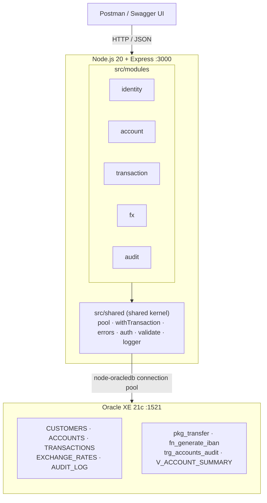
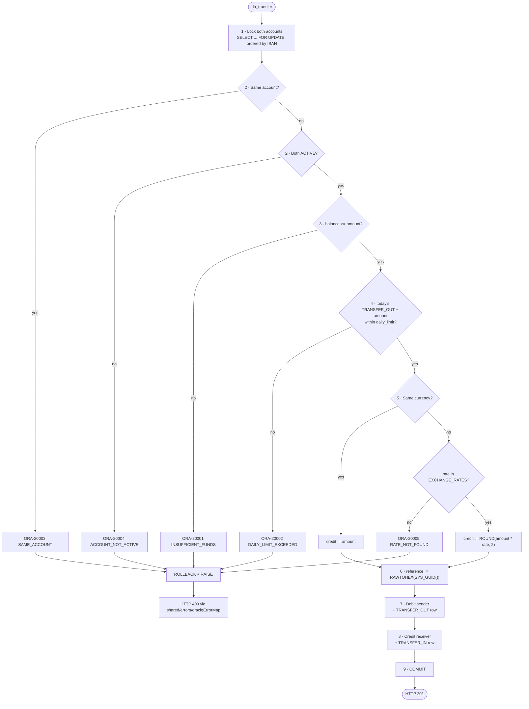
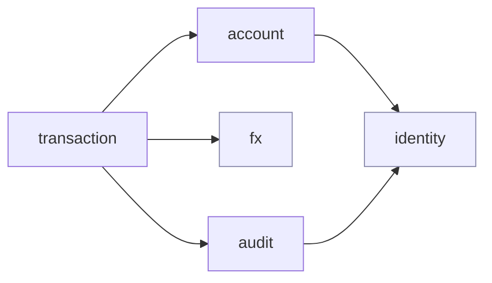

# CoreBank API

A banking transaction service - customers, accounts, deposits, withdrawals, money
transfers and statements - built as a **modular monolith** on Node.js and Oracle,
with raw SQL and PL/SQL instead of an ORM.

**Stack:** Node.js 20 · Express · Oracle XE 21c (`node-oracledb`, thin mode) · JWT · Docker Compose · Jest

---

## Architecture



One process, one database, one transaction boundary. Module borders are enforced
in source, not by network calls.

### A transfer, end to end

```mermaid
sequenceDiagram
    autonumber
    participant C as Client
    participant RT as transaction.routes
    participant SV as transaction.service
    participant AC as account/index.js
    participant DB as Oracle

    C->>RT: POST /api/transactions/transfer
    RT->>RT: auth (JWT) → rate limit → schema validation
    RT->>SV: transfer({ fromIban, toIban, amount })
    SV->>SV: assertAmount - positive, max 2 decimals
    SV->>DB: getConnection()
    SV->>AC: assertOwnership(conn, fromIban, customerId)
    AC->>DB: SELECT ... FROM ACCOUNTS WHERE iban = :iban
    DB-->>AC: row
    AC-->>SV: account, or AppError(403, FORBIDDEN)
    SV->>DB: BEGIN pkg_transfer.do_transfer(...); END;
    Note over DB: lock both rows in IBAN order,<br/>debit, credit, write two ledger rows, COMMIT
    DB-->>SV: p_reference (OUT)
    SV->>DB: conn.close()
    SV-->>C: 201 { referenceNo }
```

The service layer never wraps this call in `withTransaction`: the procedure owns
its own `COMMIT`.

### Inside `do_transfer`



---

## Getting started

```bash
cp .env.example .env
docker compose up
```

**Oracle takes 1-2 minutes to come up the first time** (longer on slower disks) -
it unpacks its data files and then runs `src/db/*.sql` once. The API container
waits for the database healthcheck, so the first `docker compose up` looks idle
for a while. Subsequent starts are fast.

| Resource | URL |
|---|---|
| Swagger UI | http://localhost:3000/api-docs |
| OpenAPI spec | http://localhost:3000/api-docs/openapi.yaml |
| Health check | http://localhost:3000/health |

### Demo users

Seeded by `src/db/05_seed.sql`.

| Email | Password | Role | Accounts |
|---|---|---|---|
| `ayse@corebank.test` | `Demo1234!` | CUSTOMER | TRY 25 000 · USD 1 200 |
| `mehmet@corebank.test` | `Demo1234!` | CUSTOMER | TRY 8 500 · EUR 640 |
| `teller@corebank.test` | `Teller1234!` | TELLER | TRY 0 |

```bash
curl -s -X POST http://localhost:3000/api/auth/login \
  -H 'Content-Type: application/json' \
  -d '{"email":"ayse@corebank.test","password":"Demo1234!"}'
```

To reload the schema from scratch, drop the volume: `docker compose down -v`.
The init scripts only run against an empty database.

---

## API

| Method | Endpoint | Module | Auth |
|---|---|---|---|
| POST | `/api/auth/register` | identity | - |
| POST | `/api/auth/login` | identity | - |
| GET | `/api/customers/me` | identity | CUSTOMER |
| POST | `/api/accounts` | account | CUSTOMER |
| GET | `/api/accounts` | account | CUSTOMER |
| GET | `/api/accounts/{iban}` | account | CUSTOMER |
| PATCH | `/api/accounts/{iban}/status` | account | TELLER |
| POST | `/api/transactions/deposit` | transaction | CUSTOMER |
| POST | `/api/transactions/withdraw` | transaction | CUSTOMER |
| POST | `/api/transactions/transfer` | transaction | CUSTOMER |
| GET | `/api/accounts/{iban}/statement` | transaction | CUSTOMER |
| GET | `/api/rates` | fx | - |
| GET | `/api/audit` | audit | TELLER |

Errors always use the same shape:

```json
{ "error": "INSUFFICIENT_FUNDS", "message": "Insufficient funds", "status": 409 }
```

The full error-code table is in the Swagger UI description and in
[`docs/openapi.yaml`](docs/openapi.yaml).

---

## Why a modular monolith?

A money transfer debits one account and credits another, and those two writes
must either both happen or neither - which is exactly what a single database
transaction gives you for free. Splitting the same operation across services
would mean replacing one `COMMIT` with a saga: a compensating "refund" step, an
outbox, idempotency keys, and a window in which money exists in neither account.
That is strictly more machinery and strictly weaker guarantees, so for this
domain it is a regression rather than an upgrade. The interesting constraint is
therefore not "how do I distribute this?" but "how do I keep hard module borders
without distribution?" - which is what the rest of this README is about.

The same problem solved with microservices and a saga:
**[EventTix](https://github.com/sehaaz/eventtix)**

---

## Module boundaries



Allowed direction only. `account` does not know `transaction`; `identity`
depends on no module. `shared/` sits underneath everything and may not import
any module.

**Five rules:**

1. **Table ownership is exclusive.** A module writes SQL only against its own
   tables - `identity`→`CUSTOMERS`, `account`→`ACCOUNTS`,
   `transaction`→`TRANSACTIONS`, `fx`→`EXCHANGE_RATES`, `audit`→`AUDIT_LOG`.
   The `transaction` module never issues `SELECT` or `UPDATE` against `ACCOUNTS`.
2. **Cross-module access goes through `index.js` only.**
   `require('../account')` is allowed; `require('../account/account.repository')`
   is not.
3. **The dependency graph is one-way and acyclic** - the diagram above.
4. **The transaction boundary lives in the calling module.** `transaction` opens
   `withTransaction` and passes the `conn` object into `account`'s public
   functions as a parameter. No repository commits or rolls back on its own.
5. **`shared/` depends on no module.** Modules may depend on `shared/`.

### Enforced by lint, not by convention

`.eslintrc.json` uses `import/no-restricted-paths` - one zone per module, plus
one for the shared kernel:

```json
{
  "target": "./src/modules/transaction",
  "from": "./src/modules",
  "except": [
    "./transaction",
    "./identity/index.js",
    "./account/index.js",
    "./fx/index.js",
    "./audit/index.js"
  ],
  "message": "Module boundary: another module may only be imported through its index.js."
},
{
  "target": "./src/shared",
  "from": "./src/modules",
  "message": "shared/ must not depend on any module."
}
```

A module may import its own files and any other module's `index.js` - nothing
else.

```console
$ npm run lint

> corebank-api@1.0.0 lint
> eslint src

$ echo $?
0
```

Adding `require('../account/account.repository')` inside the `transaction`
module fails the build:

```console
$ npm run lint

D:\bankaapi\src\modules\transaction\transaction.service.js
  1:24  error  Unexpected path "../account/account.repository" imported in restricted zone.
               Module boundary: another module may only be imported through its index.js
               import/no-restricted-paths

D:\bankaapi\src\shared\logger.js
  1:24  error  Unexpected path "../modules/account" imported in restricted zone.
               shared/ must not depend on any module  import/no-restricted-paths

2 problems (2 errors, 0 warnings)
```

---

## Why no ORM?

The parts of this project worth showing are exactly the parts an ORM hides:
explicit transaction boundaries, `SELECT ... FOR UPDATE` row locks in a chosen
order, and a stored procedure that performs a whole transfer in one round trip.
Every statement is written by hand with bind variables (`:iban`, `:amount`) -
never string concatenation - so the SQL that runs is the SQL in the file, and
the query plan is not the output of a query builder's guesswork. The cost is
mapping rows to objects manually in each repository, which is a small, contained
amount of code compared with what an abstraction layer would cost in control.

---

## The heart of the transfer: `pkg_transfer`

A transfer touches two accounts and two ledger rows. Doing it in one stored
procedure makes a half-applied transfer impossible and keeps the row locks held
for the shortest possible time - the Node process never sits between the two
`UPDATE`s.

```sql
CREATE OR REPLACE PACKAGE pkg_transfer AS
  PROCEDURE do_transfer(
    p_from_iban IN  VARCHAR2,
    p_to_iban   IN  VARCHAR2,
    p_amount    IN  NUMBER,
    p_desc      IN  VARCHAR2,
    p_reference OUT VARCHAR2
  );
END pkg_transfer;
/

CREATE OR REPLACE PACKAGE BODY pkg_transfer AS

  PROCEDURE do_transfer(
    p_from_iban IN  VARCHAR2,
    p_to_iban   IN  VARCHAR2,
    p_amount    IN  NUMBER,
    p_desc      IN  VARCHAR2,
    p_reference OUT VARCHAR2
  )
  IS
    v_from_id       ACCOUNTS.id%TYPE;
    v_from_balance  ACCOUNTS.balance%TYPE;
    v_from_currency ACCOUNTS.currency%TYPE;
    v_from_status   ACCOUNTS.status%TYPE;
    v_from_limit    ACCOUNTS.daily_limit%TYPE;

    v_to_id         ACCOUNTS.id%TYPE;
    v_to_balance    ACCOUNTS.balance%TYPE;
    v_to_currency   ACCOUNTS.currency%TYPE;
    v_to_status     ACCOUNTS.status%TYPE;

    v_today_out     NUMBER;
    v_rate          EXCHANGE_RATES.rate%TYPE;
    v_credit_amount NUMBER;
  BEGIN
    --------------------------------------------------------------------
    -- 1) Lock both accounts with FOR UPDATE, in alphabetical IBAN order.
    --
    -- Locks are ALWAYS taken from the lower IBAN to the higher one. Even when
    -- A->B and B->A run at the same time, both request the locks in the same
    -- order, so they can never wait on each other (no deadlock).
    -- The decisive point is that the order comes from a fixed criterion, NOT
    -- from the role of the account (sender/receiver).
    --------------------------------------------------------------------
    IF p_from_iban < p_to_iban THEN
      SELECT id, balance, currency, status, daily_limit
        INTO v_from_id, v_from_balance, v_from_currency, v_from_status, v_from_limit
        FROM ACCOUNTS WHERE iban = p_from_iban FOR UPDATE;

      SELECT id, balance, currency, status
        INTO v_to_id, v_to_balance, v_to_currency, v_to_status
        FROM ACCOUNTS WHERE iban = p_to_iban FOR UPDATE;
    ELSE
      SELECT id, balance, currency, status
        INTO v_to_id, v_to_balance, v_to_currency, v_to_status
        FROM ACCOUNTS WHERE iban = p_to_iban FOR UPDATE;

      SELECT id, balance, currency, status, daily_limit
        INTO v_from_id, v_from_balance, v_from_currency, v_from_status, v_from_limit
        FROM ACCOUNTS WHERE iban = p_from_iban FOR UPDATE;
    END IF;

    --------------------------------------------------------------------
    -- 2) Reject a self-transfer, and require both accounts to be ACTIVE.
    --------------------------------------------------------------------
    IF v_from_id = v_to_id THEN
      RAISE_APPLICATION_ERROR(-20003, 'SAME_ACCOUNT');
    END IF;

    IF v_from_status <> 'ACTIVE' OR v_to_status <> 'ACTIVE' THEN
      RAISE_APPLICATION_ERROR(-20004, 'ACCOUNT_NOT_ACTIVE');
    END IF;

    --------------------------------------------------------------------
    -- 3) Is the balance sufficient?
    -- The chk_balance constraint is the last line of defence; this is the real check.
    --------------------------------------------------------------------
    IF v_from_balance < p_amount THEN
      RAISE_APPLICATION_ERROR(-20001, 'INSUFFICIENT_FUNDS');
    END IF;

    --------------------------------------------------------------------
    -- 4) Daily transfer limit.
    -- Today's TRANSFER_OUT total is expressed in the sender's own currency,
    -- and daily_limit is defined in that same currency.
    --------------------------------------------------------------------
    SELECT NVL(SUM(amount), 0)
      INTO v_today_out
      FROM TRANSACTIONS
     WHERE account_id = v_from_id
       AND type       = 'TRANSFER_OUT'
       AND created_at >= TRUNC(SYSDATE)
       AND created_at <  TRUNC(SYSDATE) + 1;

    IF v_today_out + p_amount > v_from_limit THEN
      RAISE_APPLICATION_ERROR(-20002, 'DAILY_LIMIT_EXCEEDED');
    END IF;

    --------------------------------------------------------------------
    -- 5) Currency conversion.
    -- p_amount is debited from the sender; the converted amount is credited
    -- to the receiver.
    --------------------------------------------------------------------
    IF v_from_currency = v_to_currency THEN
      v_credit_amount := p_amount;
    ELSE
      BEGIN
        SELECT rate
          INTO v_rate
          FROM EXCHANGE_RATES
         WHERE base_currency   = v_from_currency
           AND target_currency = v_to_currency;
      EXCEPTION
        WHEN NO_DATA_FOUND THEN
          RAISE_APPLICATION_ERROR(-20005, 'RATE_NOT_FOUND');
      END;

      v_credit_amount := ROUND(p_amount * v_rate, 2);
    END IF;

    --------------------------------------------------------------------
    -- 6) Reference number.
    -- Both legs of the transfer share one reference; that is what ties them
    -- together on a statement.
    --------------------------------------------------------------------
    p_reference := RAWTOHEX(SYS_GUID());

    --------------------------------------------------------------------
    -- 7) Sender: debit the balance and write the TRANSFER_OUT row.
    -- RETURNING hands back the new balance, so no extra SELECT is needed.
    --------------------------------------------------------------------
    UPDATE ACCOUNTS
       SET balance = balance - p_amount
     WHERE id = v_from_id
    RETURNING balance INTO v_from_balance;

    INSERT INTO TRANSACTIONS
      (id, account_id, counter_iban, type, amount, balance_after, reference_no, description)
    VALUES
      (SEQ_TRANSACTIONS.NEXTVAL, v_from_id, p_to_iban, 'TRANSFER_OUT',
       p_amount, v_from_balance, p_reference, p_desc);

    --------------------------------------------------------------------
    -- 8) Receiver: credit the balance and write the TRANSFER_IN row.
    -- The amount on the receiving leg is the converted amount.
    --------------------------------------------------------------------
    UPDATE ACCOUNTS
       SET balance = balance + v_credit_amount
     WHERE id = v_to_id
    RETURNING balance INTO v_to_balance;

    INSERT INTO TRANSACTIONS
      (id, account_id, counter_iban, type, amount, balance_after, reference_no, description)
    VALUES
      (SEQ_TRANSACTIONS.NEXTVAL, v_to_id, p_from_iban, 'TRANSFER_IN',
       v_credit_amount, v_to_balance, p_reference, p_desc);

    --------------------------------------------------------------------
    -- 9) All or nothing.
    --------------------------------------------------------------------
    COMMIT;

  EXCEPTION
    WHEN NO_DATA_FOUND THEN
      -- One of the IBANs does not exist: the SELECT INTO in step 1 lands here.
      ROLLBACK;
      RAISE_APPLICATION_ERROR(-20006, 'ACCOUNT_NOT_FOUND');
    WHEN OTHERS THEN
      ROLLBACK;
      RAISE;
  END do_transfer;

END pkg_transfer;
/
```

### Step by step

| # | Step | Failure mode |
|---|---|---|
| 1 | Lock both account rows with `SELECT ... FOR UPDATE`, **ordered by IBAN** | - |
| 2 | Reject a self-transfer; require both accounts `ACTIVE` | `ORA-20003`, `ORA-20004` |
| 3 | Check the sender's balance under the lock | `ORA-20001` |
| 4 | Sum today's `TRANSFER_OUT` rows and compare against `daily_limit` | `ORA-20002` |
| 5 | If currencies differ, read the rate and compute the credited amount | `ORA-20005` |
| 6 | Generate `reference_no` with `RAWTOHEX(SYS_GUID())` | - |
| 7 | Debit the sender, insert the `TRANSFER_OUT` row (`RETURNING balance`) | - |
| 8 | Credit the receiver, insert the `TRANSFER_IN` row | - |
| 9 | `COMMIT` - or `ROLLBACK` and re-raise from the exception block | - |

Node maps `ORA-200xx` to HTTP status codes and stable error strings in
[`src/shared/errors/oracleErrorMap.js`](src/shared/errors/oracleErrorMap.js).

### Step 1 is the interesting one

Two concurrent transfers in opposite directions - `A → B` and `B → A` - are the
classic deadlock:

```
session 1:  lock A ... wants B
session 2:  lock B ... wants A      -> both wait forever, Oracle kills one (ORA-00060)
```

That happens when each session locks *its own sender first*, so the lock order
depends on the direction of the transfer. The procedure removes the variable:

```sql
IF p_from_iban < p_to_iban THEN
  -- lock sender, then receiver
ELSE
  -- lock receiver, then sender
END IF;
```

The order comes from a **fixed, total ordering of the rows themselves** (IBAN is
`UNIQUE NOT NULL`), not from the role an account happens to play in this call.
Both sessions therefore request the same lock first, one wins, the other blocks
briefly and proceeds. A hold-and-wait cycle cannot form, so Coffman's circular-wait
condition is never satisfied and the deadlock is prevented rather than detected.

The same lock is what makes the balance check in step 3 trustworthy: between
reading `balance` and writing it, no other session can touch that row.

---

## Concurrency and deadlock proof

Both properties are covered by integration tests that run against a real Oracle
container, not mocks.

```bash
docker compose up -d oracle     # wait until healthy
npm run test:integration
```

### `tests/integration/concurrency.integration.test.js`

Ten transfers of 20 fired simultaneously with `Promise.all` against an account
holding 100. Without the row lock all ten would read "balance is sufficient" and
the account would end at -100.

<!-- Paste a terminal screenshot here if you want one; the text output is below. -->

```console
==========================================================
  CONCURRENCY TEST - SELECT ... FOR UPDATE PROOF
==========================================================
  Sender account       : TR730006100000000000000027
  Opening balance      : 100
  Concurrent requests  : 10 x 20 units  (total 200)
----------------------------------------------------------
  201 Created          : 5   (expected 5)
  409 INSUFFICIENT     : 5   (expected 5)
  Unexpected status    : 0
----------------------------------------------------------
  Sender balance       : 0   (expected 0)
  Receiver balance     : 100   (expected 100)
  Total money          : 100   (expected 100)
  TRANSFER_OUT rows    : 5   (expected 5)
  Distinct references  : 5   (expected 5)
  Negative balance     : none
==========================================================
```

### `tests/integration/deadlock.integration.test.js`

Twenty `A → B` transfers and twenty `B → A` transfers issued at the same time.
With a role-based lock order this deadlocks; with the IBAN order it does not.

<!-- Paste a terminal screenshot here if you want one; the text output is below. -->

```console
==========================================================
  DEADLOCK TEST - FIXED LOCK ORDER PROOF
==========================================================
  A: TR190006100000000000000029
  B: TR890006100000000000000030
  Concurrent requests  : 20 x (A->B)  +  20 x (B->A)  = 40
----------------------------------------------------------
  201 Created          : 40   (expected 40)
  Failed               : 0   -
  ORA-00060 (deadlock) : NONE
----------------------------------------------------------
  A final balance      : 1000   (expected 1000)
  B final balance      : 1000   (expected 1000)
  Total money          : 2000   (expected 2000)
==========================================================
```

---

## Tests

```bash
npm test                  # unit tests, mocked repositories, no database needed
npm run test:integration  # against a running Oracle container
npm run lint              # module boundary check
```

| Suite | What it covers |
|---|---|
| `tests/account.service.test.js` | ownership violation → 403, frozen/closed account → 409 |
| `tests/transaction.service.test.js` | negative amount, 3-decimal amount, insufficient funds, ownership |
| `tests/integration/transfer.integration.test.js` | sum of balances unchanged, both legs share one `reference_no`, failed transfer changes nothing |
| `tests/integration/concurrency.integration.test.js` | `FOR UPDATE` under 10 parallel transfers |
| `tests/integration/deadlock.integration.test.js` | fixed lock order under bidirectional load |

Integration tests seed their own customers and accounts and delete them in
`afterAll`. They run with `--runInBand` because each file owns an
`node-oracledb` pool.

---

## Project structure

```
src/
├── app.js                     Express wiring, Swagger UI, error handler
├── server.js                  pool init, listen, graceful shutdown
├── modules/
│   ├── identity/              index · routes · controller · service · repository · schema
│   ├── account/               (same six files)
│   ├── transaction/
│   ├── fx/
│   └── audit/
├── shared/
│   ├── db/pool.js             oracledb.createPool
│   ├── db/withTransaction.js  conn → fn → commit / rollback → close
│   ├── errors/                AppError, oracleErrorMap
│   ├── middleware/            auth (JWT), errorHandler, validate
│   ├── config/env.js          fails fast on missing variables
│   └── logger.js              redacts passwords, tokens, full IBANs
└── db/
    ├── 01_schema.sql          tables, sequences, indexes, constraints
    ├── 02_views.sql           V_ACCOUNT_SUMMARY
    ├── 03_packages.sql        pkg_transfer, fn_generate_iban
    ├── 04_triggers.sql        trg_accounts_audit
    └── 05_seed.sql            demo customers and exchange rates
```

Every module has the same six files. `index.js` is the only file another module
is allowed to import.

---

## Security notes

- Passwords hashed with `bcrypt`, cost 12.
- JWT `HS256`, 15-minute access tokens, secret from `.env` (the process refuses
  to start without it).
- **Account ownership is re-checked against the database on every request**
  (`account.assertOwnership`) - knowing an IBAN is not authorisation.
- Amounts must be positive with at most two decimals, validated both in the
  request schema and again in the service layer.
- All SQL uses bind variables; there is no string concatenation anywhere in a
  repository.
- `helmet` on every API route, plus a stricter per-customer rate limit on the
  transfer endpoint.
- The logger redacts passwords and tokens and masks IBANs (`TR3300****1326`).

---

## Postman

[`docs/CoreBank.postman_collection.json`](docs/CoreBank.postman_collection.json)

Import it, run **identity / Login (CUSTOMER)** first - its test script writes the
JWT into the `token` collection variable and every other request picks it up
automatically. Requests marked TELLER need **identity / Login (TELLER)**.
